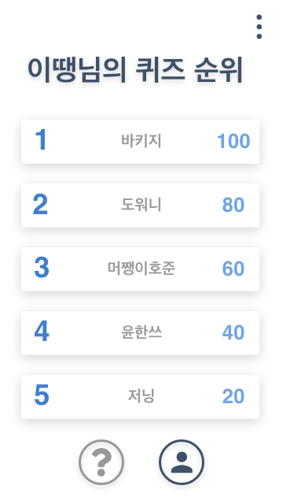

# README

## LOOKIE TOY PROJECT

### By 일비

- 봄에는 할 일이 많기 때문에 비가 와도 일을 한다.

---

## 나를 맞춰봐 Guess Me

---

## 소개글

### 나만의 퀴즈를 생성하고 친구들과 공유해 보세요~!

- 랜덤으로 엉뚱한 5가지 질문에 당신만의 대답으로 퀴즈 만들기
- 친구와 공유하여 친구의 퀴즈도 풀어보기
- 나의 퀴즈를 얼마나 잘 풀었는지 친구들의 랭킹 조회하기

     

### 주요 기능

- 로그인 회원가입
    - 아이디 중복확인
- 퀴즈 생성
    - 새로운 퀴즈 생성 시 서버로부터 랜덤 5가지 퀴즈 문항 생성
- 퀴즈 풀기
    - 닉네임을 조회하여 친구의 퀴즈 조회 및 풀기
    - 한 유저의 퀴즈 한번 풀기 가능
- 마이페이지
    - 나의 퀴즈를 푼 친구들의 점수 순위 제공
    - 퀴즈 삭제하기
    - 로그아웃

---

## Process

### 백엔드

- 스프링

### 프론트엔드

- 안드로이드
    - 언어 : Kotlin
    - 사용 기술 : Okhttp, AsynTask, RecyclerView, Json

### 버전관리

- Git

### 이슈 및 협업 일정 관리

- Github
- Notion

---

### [✍️기능 명세](https://www.notion.so/ca98be73f35545fd8779a531f6614571?v=dca2d9392e254563b645f691c24c9e39)

### [💻API](https://www.notion.so/API-0d7f33c4058a423cb3354c4d2abc9e89)

---

## 팀원

👤유호준

[@YouHojoon](https://github.com/YouHojoon)

- 서버, DB 설계 및 구현

👤박도원

[@devdw98](https://github.com/devdw98)

- 서버, DB 설계 및 구현

👤천윤한

[@CheonYoonHan](https://github.com/CheonYoonHan)

- 안드로이드
- UI 디자인 설계

👤박희지

[@HeegeePark](https://github.com/HeegeePark)

- 안드로이드
- UI 디자인 설계

👤이정인

[@jeongiin](https://github.com/jeongiin)

- 안드로이드
- UI 디자인 설계
- 배포
